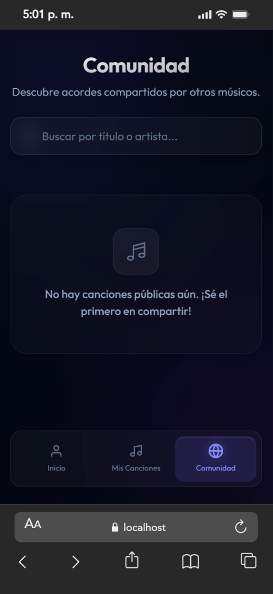
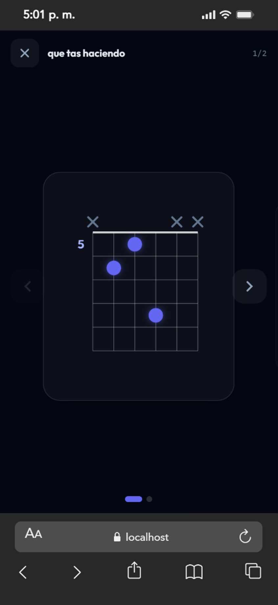
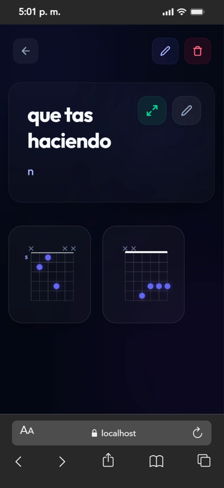

<p align="center">
  
  
  
  
  
  
</p>

<h1 align="center">🎸 MyChords</h1>

<p align="center">
A web application for creating, organizing and sharing guitar chord sheets.
</p>

<p align="center">
Built with React, TypeScript and Supabase. The app allows musicians to manage their personal chord library and explore chords shared by the community.
</p>

---
## 🌐 Live Demo

https://mychord-wine.vercel.app/

## 📸 Screenshots

<p align="center">
  
  
  
</p>
## ✨ Features

| Feature | Description |
|---|---|
| 🎵 **Song management** | Create, edit and delete songs with title, artist, capo, notes and visibility settings. |
| 🎼 **Visual chord editor** | Interactive chord diagram editor (6 strings × 5 frets) with barre support. |
| 🌐 **Community songs** | Browse chord sheets shared publicly by other users. |
| 🔐 **Authentication** | Secure user authentication powered by Supabase Auth. |
| 📲 **Installable PWA** | Install the app on mobile or desktop like a native application. |

---

## 🛠 Tech Stack

- **Frontend:** React 19 + TypeScript  
- **Styling:** Tailwind CSS  
- **Bundler:** Vite  
- **Backend:** Supabase (Auth + PostgreSQL)  
- **Routing:** React Router DOM  
- **PWA:** vite-plugin-pwa  
- **Fonts:** Google Fonts (Outfit)

---

## 🚀 Getting Started

### Prerequisites

- Node.js 18+
- Supabase account

Create a project at **Supabase**: https://supabase.com

---

### 1. Clone the repository

```bash
git clone https://github.com/TU_USUARIO/mychords.git
cd mychords
```

### 2. Install dependencies

```bash
npm install
```

### 3. Environment variables

Create a `.env.local` file in the project root:

```env
VITE_SUPABASE_URL=https://your-project.supabase.co
VITE_SUPABASE_ANON_KEY=your-anon-key
```

### 4. Run the development server

```bash
npm run dev
```

`http://localhost:5173`

---

## 📁 Project Structure

```
mychords/
├── public/                # Static assets + PWA files
├── src/
│   ├── components/        # Reusable UI components
│   ├── contexts/          # Global React contexts
│   ├── hooks/             # Custom hooks
│   ├── lib/               # Supabase client
│   ├── pages/             # Application pages
│   ├── router/            # Route configuration
│   ├── types/             # TypeScript types
│   └── main.tsx           # Application entry point
│
├── supabase-migration.sql
├── vite.config.ts
└── package.json
```
---

## 📜 Available Scripts

| Command | Description |
|---|---|
| `npm run dev` | Starts the development server |
| `npm run build` | Build the project for production |
| `npm run preview` | Preview the production build locally |
| `npm run lint` | Runs ESLint |

---

## 🗄️ Database

The application uses a songs table in Supabase:

| Column     | Type        | Description            |
| ---------- | ----------- | ---------------------- |
| id         | uuid        | Unique song identifier |
| user_id    | uuid        | Owner of the song      |
| title      | text        | Song title             |
| artist     | text        | Artist or band         |
| capo       | integer     | Capo fret              |
| notes      | text        | Lyrics or notes        |
| is_public  | boolean     | Public visibility      |
| chords     | jsonb       | Array of chord data    |
| created_at | timestamptz | Creation timestamp     |


---
## 🤝 Contributing

Contributions are welcome.

1. Fork the repository

2. Create a new branch

```bash
git checkout -b feature/my-feature
```

3. Commit your changes

```bash
git commit -m "feat: add new feature"
```

4. Push the branch

```bash
git push origin feature/my-feature
```

5. Open a Pull Request

---

## 📄 License

This project is open source
---

